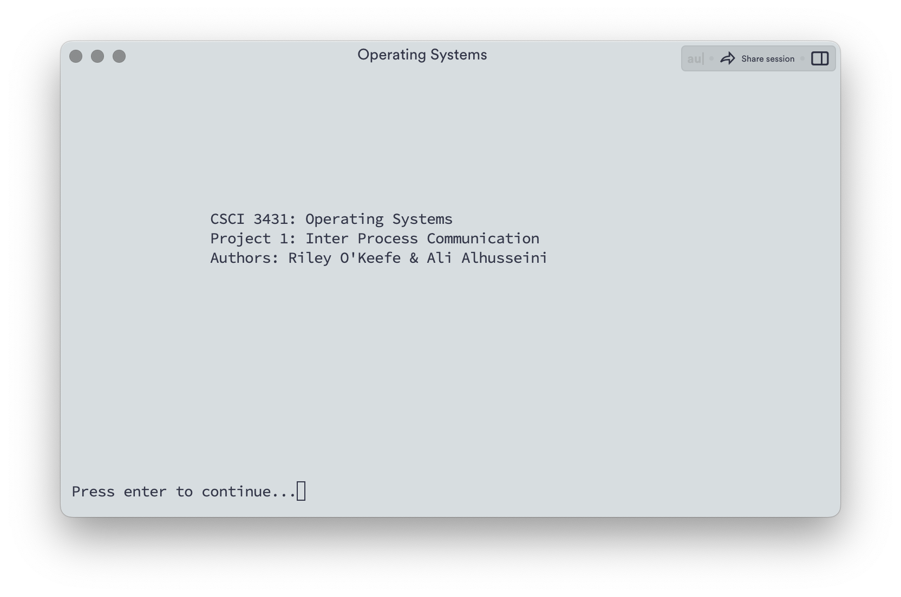
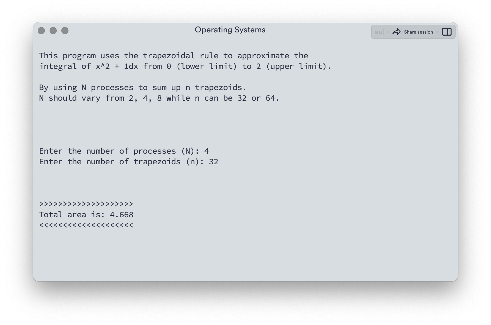

# Trapezoidal Rule

## Overview
This C program uses the Trapezoidal Rule to approximate the integral of a given function.

## Description
Through the use of inter-process communication and more specifically parent to multi-child communication, this program approximates the integral of a given function. The program makes use of system calls such as fork()/pipe() to create the children and to communicate from parent to child and vice versa. 

## Sample Output Screenshots

## Contributors
- [Ali Alhusseini](https://github.com/ali-alhusseini)
- [Riley O'Keefe](https://github.com/R0keefe)
